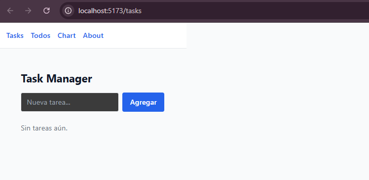

# Task Manager (React + Vite + TS)

> Gestor de tareas simple y limpio que persiste en **localStorage**, con rutas `/tasks` y `/todos` (fetch con fallback) y demo de **Recharts**. Proyecto personal **en desarrollo** cuyo objetivo final es **aprender full-stack** (frontend + backend).

[](#)
[](#)
[](LICENSE)

---

## 📸 Capturas

| Tasks                                | Todos (API)                          | Chart                                | About                                |
| ------------------------------------ | ------------------------------------ | ------------------------------------ | ------------------------------------ |
|  |  |  |  |

---

## ✨ Características

- CRUD de tareas (crear, marcar, eliminar) con **localStorage**
- Enrutado con **React Router**: `/tasks`, `/todos`, `/chart`, `/about`
- `Todos` usa `axios` hacia `VITE_API_BASE` (default: `https://jsonplaceholder.typicode.com`) con **fallback**
- **Recharts** (opcional) para estadísticas simples
- **Code splitting** (lazy) recomendado para rutas pesadas
- Calidad de código: **ESLint + Prettier + Husky + lint-staged**
- **Tests** con **Vitest** y **@testing-library/react**

---

## 🧱 Stack

- **Frontend:** React 19, TypeScript, Vite 7, React Router
- **UI:** TailwindCSS (utilidades), CSS base
- **Gráficas:** Recharts (demo)
- **HTTP:** axios
- **Tests:** Vitest, @testing-library/react, jest-dom
- **Herramientas:** ESLint, Prettier, Husky, lint-staged

---

## 🗂️ Estructura sugerida

```
src/
  App.tsx
  main.tsx
  index.css
  pages/
    Tasks.tsx
    Todos.tsx
  components/
    SampleChart.tsx         # opcional
  lib/
    api.ts                  # axios con baseURL de VITE_API_BASE
  tests/
    setupTests.ts
    tasks.test.tsx          # storage básico
docs/
  screenshots/          
```

---

## 🚀 Empezar

**Requisitos:** Node **22.x** (o 20.19+).

```bash
# Instalar dependencias
npm install

# Desarrollo
npm run dev

# Linter / Format
npm run lint
npm run format

# Tests
npm run test           # modo run
npm run test:watch     # modo watch

# Build & preview de producción
npm run build
npm run preview
```

---

## 🔒 Variables de entorno

Crea un `.env` (opcional):

```
VITE_API_BASE=https://jsonplaceholder.typicode.com
```

> Si no se define, `api.ts` usa `jsonplaceholder` por defecto.

---

## 🧪 Tests

Ejemplos incluidos:

- **`tasks.test.tsx`**: asegura lectura/escritura básica en `localStorage` (`tasks_v1`).
- **`tasks.render.test.tsx`** (opcional): prueba de UI (agregar, tildar, eliminar).

Configuración clave (`vite.config.ts`):

```ts
import { defineConfig } from 'vitest/config'
import react from '@vitejs/plugin-react'

export default defineConfig({
  plugins: [react()],
  test: {
    environment: 'jsdom',
    setupFiles: './src/tests/setupTests.ts',
    css: true,
  },
})
```

`src/tests/setupTests.ts` (1 línea):

```ts
import '@testing-library/jest-dom/vitest'
```

---

## 🧹 Calidad de código

- **ESLint** + **Prettier** configurados
- **Husky** + **lint-staged** ejecutan linter/formateo en pre-commit

```jsonc
// package.json (extracto)
{
  "scripts": {
    "dev": "vite",
    "build": "tsc -b && vite build",
    "lint": "eslint .",
    "preview": "vite preview",
    "format": "prettier --write "src/**/*.{ts,tsx,css,md,json}"",
    "prepare": "husky",
    "test": "vitest --run",
    "test:watch": "vitest"
  }
}
```

---

## ⚡ Rendimiento

Recomendado habilitar **carga perezosa (lazy)** para rutas con dependencias pesadas:

```tsx
// App.tsx (ejemplo)
import { Suspense, lazy } from 'react'
const Todos = lazy(() => import('./pages/Todos'))
const SampleChart = lazy(() => import('./components/SampleChart'))
```

Y particionar bundles con `manualChunks` si lo necesitas:

```ts
// vite.config.ts (extracto)
build: {
  rollupOptions: {
    output: {
      manualChunks: {
        react: ['react','react-dom'],
        router: ['react-router-dom'],
        recharts: ['recharts'],
      }
    }
  }
}
```

---

## 🌐 Deploy

- **Vercel**: Importa el repo → Framework **Vite** (auto) → Build `npm run build`, Output `dist/` → setea `VITE_*` si usas API propia.
- **Netlify**: Build `npm run build`, Publish `dist/`.

Añade la **URL pública** aquí cuando la tengas:

- Demo: [task-manager-delta-neon.vercel.app](https://task-manager-delta-neon.vercel.app)

---

## 🗺️ Roadmap

- [ ] Filtros y búsqueda en Tasks
- [ ] Edición inline + _bulk actions_
- [ ] Estadísticas con Recharts en `/tasks`
- [ ] Drag & Drop (orden de tareas)
- [ ] PWA (offline + install)
- [ ] Migrar storage a hook reutilizable
- [ ] **Backend .NET (Clinic API)**: endpoints reales para `/todos` y `/tasks`
- [ ] Autenticación básica (email/password) y autorización por usuario

> **Estado:** proyecto **propio en desarrollo**. La meta es **aprender y demostrar** capacidades full-stack (frontend + backend), empezando con un MVP frontend sólido y extendiéndolo con una API en .NET.

---

## 📄 Licencia

[MIT](LICENSE)

## 👤 Autor

**Paul Timothy Kuno** — juchpaul20@gmail.com  
GitHub: https://github.com/juchpaul20/task-manager

---

### English (short)

Personal learning project to practice **full-stack**. React + Vite + TS frontend with localStorage tasks, Router, axios, and a small Recharts demo. Unit/UI tests via Vitest and Testing Library. Planning to add a **.NET backend** soon.

> **Notas**
>
> - **Todos (API)**: consume `VITE_API_BASE` (por defecto JSONPlaceholder). Si falla, usa fallback local.
> - **Chart**: datos ficticios para ilustrar métricas (Recharts).
